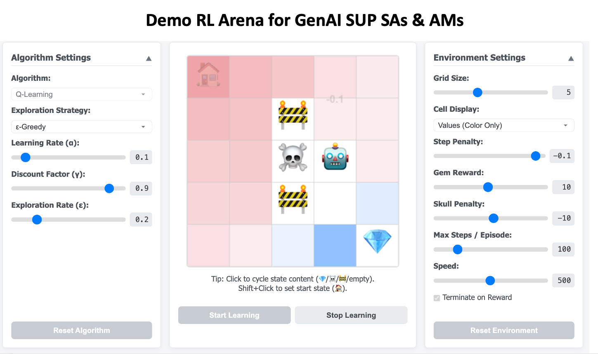

# Demo RL Arena for GenAI SUP SAs & AMs



An interactive web-based demonstration of fundamental tabular Reinforcement Learning (RL) algorithms in a simple grid world environment. Explore core **tabular RL algorithms** inside a playful grid‑world—directly in your browser, zero installs.

**[Launch the live demo here!](https://bashirmohd.github.io/sup-genai-sa_am-rl-arena/)**

## Features ✨

*   **Interactive Grid World:** Represents a simple **Markov Decision Process (MDP)**.
    *   Configurable grid size (2x2 to 10x10).
    *   Agent (🤖), Gems (💎), Hazards (☠️), and Walls (🚧) representing states, rewards, and transitions.
    *   Click to cycle cell states (💎 -> ☠️ -> 🚧 -> empty).
    *   Shift+Click to set the agent's starting position (🏠).
*   **RL Algorithms:** Demonstrating various approaches to learning optimal behavior.
    *   **Q-Learning:** (Off-Policy Temporal Difference Learning)
    *   **SARSA:** (On-Policy Temporal Difference Learning)
    *   **Expected SARSA:** (On-Policy Temporal Difference Learning)
    *   **Monte Carlo (Control):** (Learning from complete episode trajectories)
    *   **Actor-Critic (Advantage Actor-Critic):** (On-Policy, combining policy and value-based learning)
    *   **Successor Representation (SR):** (Learning a predictive state representation, decoupling states and rewards)
*   **Exploration Strategies:** Illustrating the **Exploration vs. Exploitation** trade-off.
    *   **ε-Greedy** (Used for Q-Learning, SARSA, Expected SARSA, Successor Representation)
    *   **Softmax (Boltzmann)** (Used for Q-Learning, SARSA, Expected SARSA, Actor-Critic, Successor Representation)
*   **Configurable Parameters:** Allowing experimentation with key RL hyperparameters.
    *   **Learning Rate (α):** Controls update step size, affecting convergence speed and stability.
    *   **Discount Factor (γ):** Determines the importance of future rewards (**Discounting**).
    *   **Exploration Rate (ε):** (Used for ε-Greedy)
    *   **Softmax Temperature (β):** (Used for Softmax exploration & Actor-Critic policy)
    *   **Step Penalty:** Influences the agent's path preference.
    *   **Max Steps per Episode:** Defines episode termination conditions.
    *   **Simulation Speed:** Controls visualization pace.
*   **Shareable Configurations:** Save and share complete algorithm and environment settings via URL parameters.
*   **Visualizations:** Providing insights into the learning process and learned knowledge.
    *   Real-time agent movement and learning.
    *   Animated floating text for rewards received.
    *   Cell display modes:
        *   **State Value `V(s)`** (Color / Color + Text): Visualizing the learned **Value Function**. Computed via Q-max, V-table, or SR (M, w).
        *   **Greedy Policy `π(s)`** (Arrows colored by probability): Visualizing the learned **Policy**.
    *   Current state's **Action Values `Q(s,a)`** display: Showing the expected return for each action (derived from Q-table or SR). Demonstrates the core of value-based methods.
    *   Current state's **Action Probabilities `π(a|s)`** display: Showing the agent's current action selection distribution (**Policy**).
    *   Learning progress plot (Episodic Reward - Raw & Smoothed): Tracking overall performance over time using Chart.js.
*   **Educational Content:**
    *   In-app explanations for selected algorithms and exploration strategies.
    *   Mathematical formulas (like components of the **Bellman Equation**) rendered using KaTeX.
*   **Controls:**
    *   Start / Stop Learning.
    *   Reset Algorithm (clears learned values like Q-tables, V-tables, policies, SR matrices).
    *   Reset Environment (resets grid layout).
*   **Responsive Design:** Adapts to different screen sizes.

## How to Use 🚀

### Running Locally

1.  Clone this repository:
    ```bash
    git clone https://github.io/sup-genai-sa_am-rl-arena.git
    cd sup-genai-sa_am-rl-arena
    ```
2.  Open the `index.html` file in your web browser. A simple way is often to use a live server extension in your code editor (like VS Code's Live Server) or run a basic HTTP server:
    ```bash
    # Using Python 3
    python -m http.server
    # Or using Node.js (if you have `npx` available)
    npx http-server
    ```
3.  Navigate to `http://localhost:8000` (or the port provided by your server) in your browser.

### Interacting with the Demo

1.  **Configure Settings:** Use the collapsible "Algorithm Settings" and "Environment Settings" panels to select algorithms, strategies, and adjust parameters using the sliders and dropdowns.
2.  **Modify Environment:**
    *   Click on grid cells to cycle their content (Gem -> Hazard -> Wall -> Empty).
    *   Hold `Shift` and click on an empty cell to set the agent's starting position.
3.  **Start Learning:** Press the "Start Learning" button. Observe the agent navigate the grid, the values update (demonstrating **TD Learning**, **MC Learning**, or **SR Learning** depending on the algorithm), and the progress chart evolve.
4.  **Observe:** Watch how different algorithms and parameters affect the agent's behavior and learning speed. Use the "Cell Display" options to visualize the learned values (`V(s)`, `Q(s,a)`) or policy (`π(s)`).
5.  **Control:** Use "Stop Learning", "Reset Algorithm", or "Reset Environment" as needed.

## Technology Stack 🛠️

*   HTML5
*   CSS3 (including CSS Grid for layout)
*   JavaScript (ES Modules)
*   Canvas API (for grid rendering and animations)
*   Chart.js (for progress plotting)
*   KaTeX (for math formula rendering)


## Author ©️

Copyright &copy; 2025 Bashir

## License 📄


